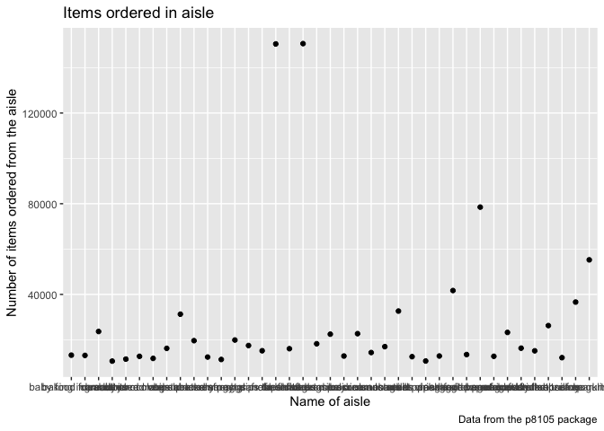

p8105\_hw3\_lc3391
================
Lu Chen
10/13/2019

Problem 1
=========

Importing daraset
-----------------

``` r
library(p8105.datasets)
data("instacart")

str(instacart)
```

    ## Classes 'tbl_df', 'tbl' and 'data.frame':    1384617 obs. of  15 variables:
    ##  $ order_id              : int  1 1 1 1 1 1 1 1 36 36 ...
    ##  $ product_id            : int  49302 11109 10246 49683 43633 13176 47209 22035 39612 19660 ...
    ##  $ add_to_cart_order     : int  1 2 3 4 5 6 7 8 1 2 ...
    ##  $ reordered             : int  1 1 0 0 1 0 0 1 0 1 ...
    ##  $ user_id               : int  112108 112108 112108 112108 112108 112108 112108 112108 79431 79431 ...
    ##  $ eval_set              : chr  "train" "train" "train" "train" ...
    ##  $ order_number          : int  4 4 4 4 4 4 4 4 23 23 ...
    ##  $ order_dow             : int  4 4 4 4 4 4 4 4 6 6 ...
    ##  $ order_hour_of_day     : int  10 10 10 10 10 10 10 10 18 18 ...
    ##  $ days_since_prior_order: int  9 9 9 9 9 9 9 9 30 30 ...
    ##  $ product_name          : chr  "Bulgarian Yogurt" "Organic 4% Milk Fat Whole Milk Cottage Cheese" "Organic Celery Hearts" "Cucumber Kirby" ...
    ##  $ aisle_id              : int  120 108 83 83 95 24 24 21 2 115 ...
    ##  $ department_id         : int  16 16 4 4 15 4 4 16 16 7 ...
    ##  $ aisle                 : chr  "yogurt" "other creams cheeses" "fresh vegetables" "fresh vegetables" ...
    ##  $ department            : chr  "dairy eggs" "dairy eggs" "produce" "produce" ...
    ##  - attr(*, "spec")=
    ##   .. cols(
    ##   ..   order_id = col_integer(),
    ##   ..   product_id = col_integer(),
    ##   ..   add_to_cart_order = col_integer(),
    ##   ..   reordered = col_integer(),
    ##   ..   user_id = col_integer(),
    ##   ..   eval_set = col_character(),
    ##   ..   order_number = col_integer(),
    ##   ..   order_dow = col_integer(),
    ##   ..   order_hour_of_day = col_integer(),
    ##   ..   days_since_prior_order = col_integer(),
    ##   ..   product_name = col_character(),
    ##   ..   aisle_id = col_integer(),
    ##   ..   department_id = col_integer(),
    ##   ..   aisle = col_character(),
    ##   ..   department = col_character()
    ##   .. )

### Short description of the dataset

-   In the dataset instacart, there are 1384617 observations of 15 variables. It composes with both numeric and categorical data. Some key variables are 'aisle', 'reordered', 'product name' and so on. One example is that the Asian Chopped Salad with Dressing with product id 18394 located on aisle 123, Packaged Vegetables and Fruits, from department 4, Produce, is reordered once by customer with user id 182389.

Summarize the dataset
---------------------

``` r
instacart %>% 
  group_by(aisle) %>% 
  summarize(n_aisle=n()) %>% 
  arrange(desc(n_aisle))
```

    ## # A tibble: 134 x 2
    ##    aisle                         n_aisle
    ##    <chr>                           <int>
    ##  1 fresh vegetables               150609
    ##  2 fresh fruits                   150473
    ##  3 packaged vegetables fruits      78493
    ##  4 yogurt                          55240
    ##  5 packaged cheese                 41699
    ##  6 water seltzer sparkling water   36617
    ##  7 milk                            32644
    ##  8 chips pretzels                  31269
    ##  9 soy lactosefree                 26240
    ## 10 bread                           23635
    ## # … with 124 more rows

``` r
#little comments: there are 134 aisles, and most intems are ordered from the aisle Fresh Vegetables.

instacart %>% 
  group_by(aisle) %>% 
  summarize(n_aisle=n()) %>% 
  filter(n_aisle > 10000) %>% 
  arrange(aisle) %>% 
  ggplot(aes(x = aisle, y = n_aisle)) +
  geom_point() +
  labs(
    title = "Items ordered in aisle",
    x = "Name of aisle",
    y = "Number of items ordered from the aisle",
    caption = "Data from the p8105 package"
  ) 
```



``` r
#Little comments: there are many aisles with more than 10000 items ordered, and the top 3 are: fresh veges, fresh fruits, and packaged vege and fruits.

instacart %>% 
  filter(aisle %in% c("baking ingredients", "dog food care", "packaged vegetables fruits")) %>% 
  group_by(aisle, product_name) %>% 
  summarize(sum_orders = sum(order_number)) %>% 
  mutate(order_rank = min_rank(desc(sum_orders))) %>%
  filter(order_rank %in% c(1,2,3)) %>%
  arrange(aisle, order_rank) %>% 
  knitr::kable()
```

| aisle                      | product\_name                                 |  sum\_orders|  order\_rank|
|:---------------------------|:----------------------------------------------|------------:|------------:|
| baking ingredients         | Light Brown Sugar                             |         8605|            1|
| baking ingredients         | Cane Sugar                                    |         6244|            2|
| baking ingredients         | Organic Vanilla Extract                       |         6003|            3|
| dog food care              | Standard Size Pet Waste bags                  |          675|            1|
| dog food care              | Beef Stew Canned Dog Food                     |          631|            2|
| dog food care              | Snack Sticks Chicken & Rice Recipe Dog Treats |          589|            3|
| packaged vegetables fruits | Organic Baby Spinach                          |       171301|            1|
| packaged vegetables fruits | Organic Raspberries                           |       113932|            2|
| packaged vegetables fruits | Organic Blueberries                           |        86765|            3|

``` r
#little comments: The three most popular items in baking ingredients aisle are Light Brown Sugar, Cane Sugar, and Organic Vanilla Extract; that in dog food care aisle are Standard Size Pet Waste Bags, Beef Stew Canned Dog Food, and Snack Sticks Chicken & Rice Recipe Dog Treats; that in packaged vegetables fruits aisle are Organic Baby Spainach, Organic Raspberries and Organic Blueberries.
```
