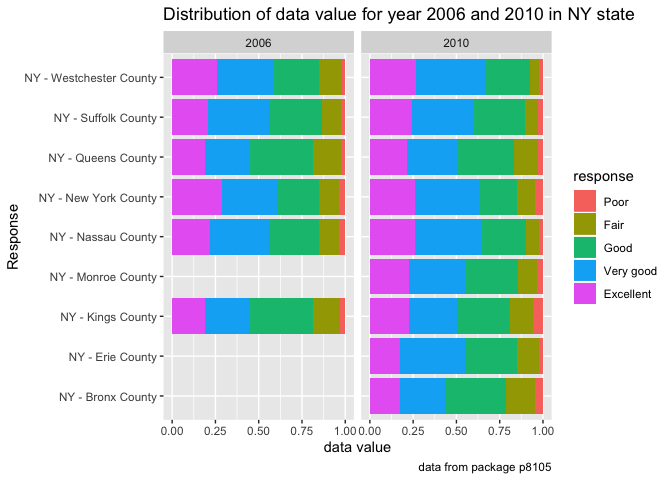

p8105\_hw3\_lc3391
================
Lu Chen
10/13/2019

Problem 1
=========

Importing dataset
-----------------

``` r
library(p8105.datasets)
data("instacart")

str(instacart)
```

    ## Classes 'tbl_df', 'tbl' and 'data.frame':    1384617 obs. of  15 variables:
    ##  $ order_id              : int  1 1 1 1 1 1 1 1 36 36 ...
    ##  $ product_id            : int  49302 11109 10246 49683 43633 13176 47209 22035 39612 19660 ...
    ##  $ add_to_cart_order     : int  1 2 3 4 5 6 7 8 1 2 ...
    ##  $ reordered             : int  1 1 0 0 1 0 0 1 0 1 ...
    ##  $ user_id               : int  112108 112108 112108 112108 112108 112108 112108 112108 79431 79431 ...
    ##  $ eval_set              : chr  "train" "train" "train" "train" ...
    ##  $ order_number          : int  4 4 4 4 4 4 4 4 23 23 ...
    ##  $ order_dow             : int  4 4 4 4 4 4 4 4 6 6 ...
    ##  $ order_hour_of_day     : int  10 10 10 10 10 10 10 10 18 18 ...
    ##  $ days_since_prior_order: int  9 9 9 9 9 9 9 9 30 30 ...
    ##  $ product_name          : chr  "Bulgarian Yogurt" "Organic 4% Milk Fat Whole Milk Cottage Cheese" "Organic Celery Hearts" "Cucumber Kirby" ...
    ##  $ aisle_id              : int  120 108 83 83 95 24 24 21 2 115 ...
    ##  $ department_id         : int  16 16 4 4 15 4 4 16 16 7 ...
    ##  $ aisle                 : chr  "yogurt" "other creams cheeses" "fresh vegetables" "fresh vegetables" ...
    ##  $ department            : chr  "dairy eggs" "dairy eggs" "produce" "produce" ...
    ##  - attr(*, "spec")=
    ##   .. cols(
    ##   ..   order_id = col_integer(),
    ##   ..   product_id = col_integer(),
    ##   ..   add_to_cart_order = col_integer(),
    ##   ..   reordered = col_integer(),
    ##   ..   user_id = col_integer(),
    ##   ..   eval_set = col_character(),
    ##   ..   order_number = col_integer(),
    ##   ..   order_dow = col_integer(),
    ##   ..   order_hour_of_day = col_integer(),
    ##   ..   days_since_prior_order = col_integer(),
    ##   ..   product_name = col_character(),
    ##   ..   aisle_id = col_integer(),
    ##   ..   department_id = col_integer(),
    ##   ..   aisle = col_character(),
    ##   ..   department = col_character()
    ##   .. )

### Short description of the dataset

-   In the dataset instacart, there are 1384617 observations of 15 variables. It composes with both numeric and categorical data. Some key variables are 'aisle', 'reordered', 'product name' and so on. One example is that the Asian Chopped Salad with Dressing with product id 18394 located on aisle 123, Packaged Vegetables and Fruits, from department 4, Produce, is reordered once by customer with user id 182389.

Summarize the dataset
---------------------

``` r
instacart %>% 
  group_by(aisle) %>% 
  summarize(n_aisle=n()) %>% 
  arrange(desc(n_aisle))
```

    ## # A tibble: 134 x 2
    ##    aisle                         n_aisle
    ##    <chr>                           <int>
    ##  1 fresh vegetables               150609
    ##  2 fresh fruits                   150473
    ##  3 packaged vegetables fruits      78493
    ##  4 yogurt                          55240
    ##  5 packaged cheese                 41699
    ##  6 water seltzer sparkling water   36617
    ##  7 milk                            32644
    ##  8 chips pretzels                  31269
    ##  9 soy lactosefree                 26240
    ## 10 bread                           23635
    ## # … with 124 more rows

``` r
#little comments: there are 134 aisles, and most intems are ordered from the aisle Fresh Vegetables.

instacart %>% 
  group_by(aisle) %>% 
  summarize(n_aisle=n()) %>% 
  filter(n_aisle > 10000) %>% 
  arrange(aisle) %>% 
  ggplot(aes(x = aisle, y = n_aisle)) +
  geom_point() +
  labs(
    title = "Items ordered in aisle",
    x = "Name of aisle",
    y = "Number of items ordered from the aisle",
    caption = "Data from the p8105 package"
  ) 
```


``` r
#Little comments: there are many aisles with more than 10000 items ordered, and the top 3 are: fresh veges, fresh fruits, and packaged vege and fruits.

instacart %>% 
  filter(aisle %in% c("baking ingredients", "dog food care", "packaged vegetables fruits")) %>% 
  group_by(aisle, product_name) %>% 
  summarize(sum_orders = sum(order_number)) %>% 
  mutate(order_rank = min_rank(desc(sum_orders))) %>%
  filter(order_rank %in% c(1,2,3)) %>%
  arrange(aisle, order_rank) %>% 
  knitr::kable()
```

| aisle                      | product\_name                                 |  sum\_orders|  order\_rank|
|:---------------------------|:----------------------------------------------|------------:|------------:|
| baking ingredients         | Light Brown Sugar                             |         8605|            1|
| baking ingredients         | Cane Sugar                                    |         6244|            2|
| baking ingredients         | Organic Vanilla Extract                       |         6003|            3|
| dog food care              | Standard Size Pet Waste bags                  |          675|            1|
| dog food care              | Beef Stew Canned Dog Food                     |          631|            2|
| dog food care              | Snack Sticks Chicken & Rice Recipe Dog Treats |          589|            3|
| packaged vegetables fruits | Organic Baby Spinach                          |       171301|            1|
| packaged vegetables fruits | Organic Raspberries                           |       113932|            2|
| packaged vegetables fruits | Organic Blueberries                           |        86765|            3|

``` r
#little comments: The three most popular items in baking ingredients aisle are Light Brown Sugar, Cane Sugar, and Organic Vanilla Extract; that in dog food care aisle are Standard Size Pet Waste Bags, Beef Stew Canned Dog Food, and Snack Sticks Chicken & Rice Recipe Dog Treats; that in packaged vegetables fruits aisle are Organic Baby Spainach, Organic Raspberries and Organic Blueberries.

instacart %>% 
  mutate(order_dow = recode(order_dow, "0" = "Sunday", "1" = "Monday", "2" = "Tuesday", "3" = "Wednesday", 
                            "4" = "Thursday", "5" = "Friday", "6" = "Saturday")) %>% 
  filter(product_name %in% c("Pink Lady Apples", "Coffee Ice Cream")) %>% 
  group_by(product_name, order_dow) %>% 
  summarize(mean_hour_of_day = mean(order_hour_of_day)) %>%
  pivot_wider(names_from = order_dow, values_from = mean_hour_of_day) %>% 
  knitr::kable()
```

| product\_name    |    Friday|    Monday|  Saturday|    Sunday|  Thursday|   Tuesday|  Wednesday|
|:-----------------|---------:|---------:|---------:|---------:|---------:|---------:|----------:|
| Coffee Ice Cream |  12.26316|  14.31579|  13.83333|  13.77419|  15.21739|  15.38095|   15.31818|
| Pink Lady Apples |  12.78431|  11.36000|  11.93750|  13.44118|  11.55172|  11.70213|   14.25000|

``` r
#little comments: The mean order hour of the day for both products are concentrated on noon to afternoon (about 11:00 to 15:00).
```

Problem 2
---------

### Importing and cleaning the dataset

``` r
library(p8105.datasets)
data("brfss_smart2010")

brfss_smart2010 = 
  brfss_smart2010 %>% 
  janitor::clean_names() %>% 
  filter(topic %in% c("Overall Health"), response %in% c("Excellent","Very good", "Good", "Fair", "Poor")) %>% 
  mutate(response = fct_relevel(response, "Poor","Fair","Good","Very good","Excellent"))
```

### Summarize the dataset

``` r
brfss_smart2010 %>% 
  filter(year %in% c("2002")) %>% 
  group_by(locationabbr, locationdesc) %>% 
  summarize(n_loc = n()) %>% 
  group_by(locationabbr) %>% 
  summarize(n_loc = n()) %>% 
  filter(n_loc >= 7)
```

    ## # A tibble: 6 x 2
    ##   locationabbr n_loc
    ##   <chr>        <int>
    ## 1 CT               7
    ## 2 FL               7
    ## 3 MA               8
    ## 4 NC               7
    ## 5 NJ               8
    ## 6 PA              10

``` r
#little comments: 6 states were observed at 7 or more locations, and they are CT, FL, MA, NC, NJ, and PA.

brfss_smart2010 %>% 
  filter(year %in% c("2010")) %>% 
  group_by(locationabbr, locationdesc) %>% 
  summarize(n_loc = n()) %>% 
  group_by(locationabbr) %>% 
  summarize(n_loc = n()) %>% 
  filter(n_loc >= 7)
```

    ## # A tibble: 14 x 2
    ##    locationabbr n_loc
    ##    <chr>        <int>
    ##  1 CA              12
    ##  2 CO               7
    ##  3 FL              41
    ##  4 MA               9
    ##  5 MD              12
    ##  6 NC              12
    ##  7 NE              10
    ##  8 NJ              19
    ##  9 NY               9
    ## 10 OH               8
    ## 11 PA               7
    ## 12 SC               7
    ## 13 TX              16
    ## 14 WA              10

``` r
#little comments: there are 14 states were observed at 7 or more locations, and they are CA, CO, FL, MA, MD, NC, NE, NJ, NY, OH, PA, SC, TX, and WA.

brfss_smart2010 %>% 
  filter(response %in% c("Excellent")) %>% 
  group_by(year, locationabbr, locationdesc) %>% 
  summarize(average_data_value = mean(data_value)) %>%
  select(year, locationabbr, locationdesc, average_data_value) %>% 
  ggplot(aes(x = year, y = average_data_value)) +
  geom_line(aes(group = locationabbr)) +
  labs(
    title = "Spaghetti plot",
    x = "Year",
    y = "Average data value",
    caption = "Data from p8105 package"
  )
```


``` r
brfss_smart2010 %>% 
  filter(year %in% c("2006","2010"), 
         response %in% c("Excellent", "Very good", "Good", "Fair","Poor"), 
         locationabbr == "NY") %>% 
  ggplot(aes(x = response, y = data_value)) +
  geom_boxplot() +
  facet_grid(. ~ year) +
  labs(
    title = "Distribution of data value for year 2006 and 2010 in NY state",
    x = "Response",
    y = "data value",
    caption = "data from package p8105"
  )
```



Problem 3
---------

### reading in dataset and do the cleaning

``` r
accel_data = read_csv("./data/accel_data.csv") %>% 
  janitor::clean_names() %>% 
  mutate(wkdays_wkends = case_when(
     day %in% c("Monday","Tuesday","Wednesday","Thursday","Friday") ~ "Weekday",
     day %in% c("Saturday","Sunday") ~ "Weekend"
  )) %>% 
  select(week, day_id, day, wkdays_wkends, everything())
```

    ## Parsed with column specification:
    ## cols(
    ##   .default = col_double(),
    ##   day = col_character()
    ## )

    ## See spec(...) for full column specifications.

``` r
str(accel_data)
```

    ## Classes 'spec_tbl_df', 'tbl_df', 'tbl' and 'data.frame': 35 obs. of  1444 variables:
    ##  $ week         : num  1 1 1 1 1 1 1 2 2 2 ...
    ##  $ day_id       : num  1 2 3 4 5 6 7 8 9 10 ...
    ##  $ day          : chr  "Friday" "Monday" "Saturday" "Sunday" ...
    ##  $ wkdays_wkends: chr  "Weekday" "Weekday" "Weekend" "Weekend" ...
    ##  $ activity_1   : num  88.4 1 1 1 47.4 ...
    ##  $ activity_2   : num  82.2 1 1 1 48.8 ...
    ##  $ activity_3   : num  64.4 1 1 1 46.9 ...
    ##  $ activity_4   : num  70 1 1 1 35.8 ...
    ##  $ activity_5   : num  75 1 1 1 49 ...
    ##  $ activity_6   : num  66.3 1 1 1 44.8 ...
    ##  $ activity_7   : num  53.8 1 1 1 73.4 ...
    ##  $ activity_8   : num  47.8 1 1 1 24.3 ...
    ##  $ activity_9   : num  55.5 1 1 1 34.5 ...
    ##  $ activity_10  : num  43 1 1 1 72.8 ...
    ##  $ activity_11  : num  46.8 1 1 1 40.4 ...
    ##  $ activity_12  : num  25.5 1 1 1 56.1 ...
    ##  $ activity_13  : num  19 1 1 32 50 ...
    ##  $ activity_14  : num  31.1 1 1 1 35.3 ...
    ##  $ activity_15  : num  22.9 1 1 1 35.5 ...
    ##  $ activity_16  : num  24.8 1 1 1 59.7 ...
    ##  $ activity_17  : num  51 1 1 32 28.3 ...
    ##  $ activity_18  : num  35.5 1 1 1 32 ...
    ##  $ activity_19  : num  41 1 1 85 48.8 ...
    ##  $ activity_20  : num  59 1 1 116 31.7 ...
    ##  $ activity_21  : num  25.2 1 1 1 21 ...
    ##  $ activity_22  : num  19.4 1 1 1 17.8 ...
    ##  $ activity_23  : num  44.7 1 1 1 32.6 ...
    ##  $ activity_24  : num  17.1 1 1 1 18.1 ...
    ##  $ activity_25  : num  43.9 1 1 1 61.2 ...
    ##  $ activity_26  : num  47.5 1 1 1 56.6 ...
    ##  $ activity_27  : num  46.1 1 1 11 55.2 ...
    ##  $ activity_28  : num  34.6 1 1 1 92.1 ...
    ##  $ activity_29  : num  40.3 1 1 150 31.3 ...
    ##  $ activity_30  : num  46.5 1 1 1 45.5 ...
    ##  $ activity_31  : num  53.2 1 379 11 37.9 ...
    ##  $ activity_32  : num  23.8 1 696 1 22.2 ...
    ##  $ activity_33  : num  35.3 1 759 1 18.2 ...
    ##  $ activity_34  : num  30.7 1 1168 64 26 ...
    ##  $ activity_35  : num  40.1 1 150 276 19.5 ...
    ##  $ activity_36  : num  25.3 1 53 1 8.2 ...
    ##  $ activity_37  : num  8.89 1 95 1 16.6 ...
    ##  $ activity_38  : num  14.7 1 150 1 18.1 ...
    ##  $ activity_39  : num  18.5 1 32 1 39.6 ...
    ##  $ activity_40  : num  40.7 1 74 1 21.2 ...
    ##  $ activity_41  : num  20 1 137 1 30.4 ...
    ##  $ activity_42  : num  37.1 1 305 1 38.3 ...
    ##  $ activity_43  : num  22.6 1 305 1 53 ...
    ##  $ activity_44  : num  22.8 1 43 1 37.2 ...
    ##  $ activity_45  : num  16.1 1 85 163 45.8 ...
    ##  $ activity_46  : num  29.8 1 64 1 22.4 ...
    ##  $ activity_47  : num  39.4 1 1 1 20.6 ...
    ##  $ activity_48  : num  29.7 1 1 1 37.3 ...
    ##  $ activity_49  : num  54.8 1 1 95 42.3 ...
    ##  $ activity_50  : num  48.3 1 1 1 44 ...
    ##  $ activity_51  : num  66.1 1 1 1 41.8 ...
    ##  $ activity_52  : num  65.2 1 1 1 58.3 ...
    ##  $ activity_53  : num  35.7 1 1 1 63.8 ...
    ##  $ activity_54  : num  31.7 1 1 1 31.7 ...
    ##  $ activity_55  : num  26 1 1 1 24.6 ...
    ##  $ activity_56  : num  36.6 1 1 1 29.1 ...
    ##  $ activity_57  : num  25.2 1 1 1 19 ...
    ##  $ activity_58  : num  27.9 1 1 1 54.6 ...
    ##  $ activity_59  : num  58 1 1 1 35.9 ...
    ##  $ activity_60  : num  44.2 1 1 1 34.1 ...
    ##  $ activity_61  : num  46.8 1 1 1 40 ...
    ##  $ activity_62  : num  41.7 1 1 1 25.2 ...
    ##  $ activity_63  : num  57 1 1 1 35 ...
    ##  $ activity_64  : num  51.2 1 1 1 41.6 ...
    ##  $ activity_65  : num  63.5 1 1 1 23.9 ...
    ##  $ activity_66  : num  45.4 1 11 1 19.3 ...
    ##  $ activity_67  : num  44.89 1 1 1 8.64 ...
    ##  $ activity_68  : num  21.7 1 11 1 12.9 ...
    ##  $ activity_69  : num  11.6 1 1 1 11.7 ...
    ##  $ activity_70  : num  37.4 1 1 1 15 ...
    ##  $ activity_71  : num  36.1 1 1 1 22.7 ...
    ##  $ activity_72  : num  25.8 1 1 1 50.5 ...
    ##  $ activity_73  : num  15.1 1 1 1 19.6 ...
    ##  $ activity_74  : num  38.5 1 1 1 18.5 ...
    ##  $ activity_75  : num  46.7 1 1 1 34.1 ...
    ##  $ activity_76  : num  50.1 1 1 11 27.3 ...
    ##  $ activity_77  : num  52.5 1 1 43 33.8 ...
    ##  $ activity_78  : num  67.9 1 1 1 10.3 ...
    ##  $ activity_79  : num  71.4 1 1 1 11.2 ...
    ##  $ activity_80  : num  61.1 1 1 1 8.2 ...
    ##  $ activity_81  : num  35.4 1 1 74 27.6 ...
    ##  $ activity_82  : num  41.5 1 1 1 10.6 ...
    ##  $ activity_83  : num  46.6 1 1 74 28 ...
    ##  $ activity_84  : num  38.3 1 1 85 30.7 ...
    ##  $ activity_85  : num  23.4 1 1 1 57.1 ...
    ##  $ activity_86  : num  68.7 1 1 1 29.9 ...
    ##  $ activity_87  : num  44 1 1 1 41.9 ...
    ##  $ activity_88  : num  33.82 1 1 1 7.71 ...
    ##  $ activity_89  : num  21.3 1 1 1 19.4 ...
    ##  $ activity_90  : num  37.1 1 1 1 19.2 ...
    ##  $ activity_91  : num  46.8 1 1 1 7.8 ...
    ##  $ activity_92  : num  46.87 1 1 1 4.71 ...
    ##  $ activity_93  : num  39.78 1 1 1 7.27 ...
    ##  $ activity_94  : num  26.8 1 1 1 15.3 ...
    ##  $ activity_95  : num  22.7 1 1 1 25.9 ...
    ##   [list output truncated]

``` r
# Comments: there are 35 observations of 1444 variables. Other than week, day_id, day, and weekday vs. weekend, the dataset contains activity counts for each minute of a 24-hour day starting at midnight.

accel_data %>% 
  mutate(tot_act_each = rowSums(select(.,activity_1:activity_1440))) %>%
  select(week, day_id, day, wkdays_wkends, tot_act_each) %>% 
  mutate(day_int = case_when(
     day == "Monday" ~ 1, day == "Tuesday" ~ 2, day == "Wednesday" ~ 3, day == "Thursday" ~ 4,
     day == "Friday" ~ 5, day == "Saturday" ~ 6, day == "Sunday" ~ 7
  )) %>% 
  arrange(week, day_int) %>% 
  select(week, day, tot_act_each) %>% 
  pivot_wider(names_from = week, values_from = tot_act_each) %>% 
  knitr::kable()
```

| day       |          1|       2|       3|       4|       5|
|:----------|----------:|-------:|-------:|-------:|-------:|
| Monday    |   78828.07|  295431|  685910|  409450|  389080|
| Tuesday   |  307094.24|  423245|  381507|  319568|  367824|
| Wednesday |  340115.01|  440962|  468869|  434460|  445366|
| Thursday  |  355923.64|  474048|  371230|  340291|  549658|
| Friday    |  480542.62|  568839|  467420|  154049|  620860|
| Saturday  |  376254.00|  607175|  382928|    1440|    1440|
| Sunday    |  631105.00|  422018|  467052|  260617|  138421|

``` r
# comments: no apparent trends shown here

accel_data %>% 
  mutate(tot_act_each = rowSums(select(.,activity_1:activity_1440))) %>% 
  select(week, day_id, day, wkdays_wkends, tot_act_each) %>% 
  ggplot(aes(x = week, y = tot_act_each, color = day)) + 
  geom_point() +
  geom_smooth(size = 0.5, se = FALSE) +
  labs(
    title = "the 24-hour activity time courses for each day",
    x = "Week", 
    y = "Activity counts per day"
    ) 
```

    ## `geom_smooth()` using method = 'loess' and formula 'y ~ x'


``` r
# comments: the patient has a relatively unstable activity pattern for each day. It varies a lot from starting to ending point. On Monday and Saturday, the variation is greater than other days. And on Tuesday and Wednesday, the activity is quite stable.
```
